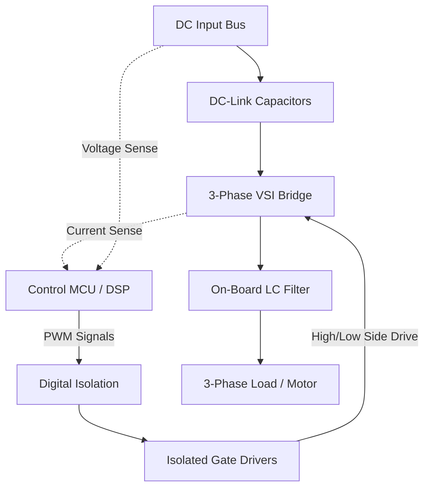

Designing a medium-power 3-phase inverter involves much more than simply stringing together six MOSFETs. When pushing 500W of continuous power, parasitic inductance, thermal dissipation, and gate drive isolation become critical engineering challenges. 

This case study breaks down the architecture and design decisions behind my **[500W 3-Phase Inverter Board](https://github.com/wayri/3-Phase-inverter-board)**, focusing on robustness, filter integration, and physical layout.

---

### System Architecture

The core topology is a standard 3-phase, 2-level Voltage Source Inverter (VSI). However, the complexity lies in the supporting subsystems required to make it reliable at scale.



#### The DC-Link and Decoupling
One of the most critical aspects of any high-power inverter is the DC-link capacitor bank. High-frequency PWM switching draws massive ripple currents. If the DC-link capacitors have high Equivalent Series Resistance (ESR) or Equivalent Series Inductance (ESL), it leads to severe voltage ringing and premature capacitor failure due to heating.

To mitigate this, the board supports multiple capacitor footprint options, allowing for a mix of bulk electrolytic capacitors (for low-frequency energy storage) and high-frequency ceramic/film capacitors placed immediately adjacent to the switching nodes.

---

### Gate Drive and Isolation

Switching 500W efficiently requires fast turn-on and turn-off times to minimize switching losses ($P_{sw}$). However, high $dV/dt$ rates induce parasitic ringing and EMI.

```ascii
     +HV DC
       |
     | D |  (High-Side Switch)
     +---+
       |--------> Phase Output (U, V, W)
     +---+
     | D |  (Low-Side Switch)
       |
      GND
```

To drive the high-side MOSFETs, a bootstrap topology is often sufficient, but true galvanic isolation is preferred for robustness against fault conditions. The architecture incorporates:
1. **Digital Isolators**: Separating the delicate MCU logic signals from the noisy power stage.
2. **Robust Gate Drivers**: Capable of sinking/sourcing peak currents necessary to charge the MOSFET gate capacitance rapidly.
3. **Desaturation Protection**: (Optional depending on the exact switch choice) to detect overcurrent conditions and safely shut down the bridge before thermal runaway occurs.

---

### Output Filter Design

A raw PWM output is highly harmonic. For applications requiring a clean sinusoidal voltage (like driving sensitive AC motors or grid-tie applications), a robust low-pass filter is mandatory.

This board was designed with **on-board filter options**. 
- The **Inductor ($L$)** limits the current ripple. Careful attention was paid to the magnetic core material to prevent saturation at peak 500W currents.
- The **Capacitor ($C$)** shunts high-frequency switching noise to ground.

By integrating the filter directly onto the board, the EMI footprint of the entire system is drastically reduced compared to running noisy PWM signals over long cables to an external filter.

---

### Physical Layout & Thermal Management

The physical layer is unforgiving. A schematic can be flawless, but a poor PCB layout will destroy a 500W inverter in seconds.

**Key Layout Principles Applied:**
1. **Minimizing Commutation Loops**: The loop from the DC-link capacitor, through the high-side switch, through the low-side switch, and back to the capacitor must be physically as small as possible to minimize parasitic inductance ($L_{loop}$). High $L_{loop}$ combined with high $di/dt$ causes destructive voltage spikes ($V = L \cdot di/dt$).
2. **Thermal Planes**: The copper pours carrying phase currents are sized not just for electrical resistance, but as thermal radiators. 
3. **Trace Clearance**: Ensuring adequate creepage and clearance distances between the high-voltage DC bus and the low-voltage control circuitry to prevent arcing.

### Conclusion

Building a 500W 3-Phase Inverter is an exercise in balancing opposing forces: switching fast enough to be efficient, but slow enough to manage EMI; keeping loops tight while maintaining high-voltage clearances. The resulting board serves as a robust platform for motor control and power conversion R&D.
